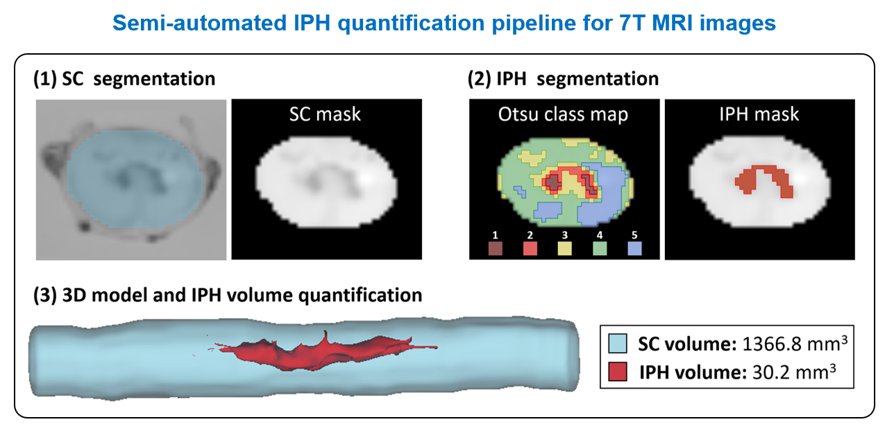

# hemseg
Semi-automated MATLAB pipeline for Otsu-based segmentation of intra-parenchymal hemorrhage (IPH) in spinal cord MRI
---

## Overview

This code repository represents a data analysis workflow to segment areas of hemorrhage from MRI volumes.  The approach is semi-automated in the following way:

- **Otsu-based segmentation**:  an **automatic procedure** based on [*Otsu's method*](https://en.wikipedia.org/wiki/Otsu%27s_method) sets a predefined number of pixel intensity thresholds, so that all pixels are classified according to their intensity range.  In brief, *Otsu's method* divides the pixel intensity histogram so that each region has minimized intra-class variance, thereby setting the threshold values in between peaks in the distribution.  Each pixel is assigned a segmentation label which reflects the intensity bin that the pixel belongs to, leading to a "classmap" of labels that show patches of pixels in the cord with similar intensity.

- **Interactive selection of hemorrhage areas in the classmap**:  an interactive user interface is used to **manually** select individual patches in the segmentation classmap (usually considered to be areas of abnormal hypointensity).

In this way, the user can exercise their own subjective judgement about what patches in the classmap to include, but has no choice about the shape or distribution of the classmap itself.

## Assumptions and Required Software

This workflow was tested with the following experimental conditions:

- ex vivo pig spinal cord
- 7 Tesla MRI scanner (Bruker Biospec 70/30 USR) Paravision 5.1
- Scan protocols showing hemorrhage as negative-contrast regions:
	- **T2-weighted FSE or RARE**:  used to generate a mask of the external spinal cord boundaries
	- **SWI or MEDIC/MERGE/mFFE**:  signal average (possibly with SWI phase-filtering) of individual echoes in a multi-gradient-echo (MGE) acquisition, which is used for hemorrhage segmentation

The required software to implement this workflow includes:
- **3D Slicer** ([download.slicer.org](download.slicer.org):  used to define the initial spinal cord mask and to calculate the surface area/volume on the final hemorrhage segmentation.  Tested with v. 4.11
- **MATLAB** ([mathworks.com](www.mathworks.com)):  used to generate the automatic Otsu thresholds and provide the user interface for the manual selection of the classmap patches to include in the hemorrhage segmentation.  Tested with MATLAB 2024b.

The workflow assumes that all data is in the **NRRD** format, which is the native image file format for 3D Slicer. DICOM files can easily be loaded by 3D Slicer using the DICOM module, and then subsequently saved to NRRD format through Slicer's Save module.

## Usage

The program files in the `code` directory should be downloaded to your computer and be added to the MATLAB path (as described [here](https://www.mathworks.com/help/matlab/matlab_env/add-remove-or-reorder-folders-on-the-search-path.html)).  There are three main MATLAB scripts that should be modified and run as needed:

- `Otsu_segmentation_fileinfo.m`:  specifies the setup/configuration info for each experimental session (names of image/mask files, number of Otsu thresholds, etc.) and saves this information to a data file (`Otsu_hem_fileinfo.mat`)
- `Otsu_segmentation_cordmask_from_FSE_script.m`:  take a mask image file (manually defined in 3D Slicer) and produce a cropped version of the input image, showing only the segmented cord
- `Otsu_segmentation_hemorrhage_mask_script.m`: generates the Otsu-derived segmentation classmap, and presents the user with an interactive interface to select the classmap patches that will be included in the hemorrhage segmentation.

Customizing these scripts for your project will mostly involve setting the input and output data paths at the top of each MATLAB script file, and entering the configuration information in `Otsu_segmentation_fileinfo.m` for each experimental dataset.

The instructions for executing this workflow is detailed in this [document](hemseg_guide.pdf).

<figure>
  
  <figcaption>Overview of hemorrhage segmentation analysis pipeline</figcaption>
</figure>
